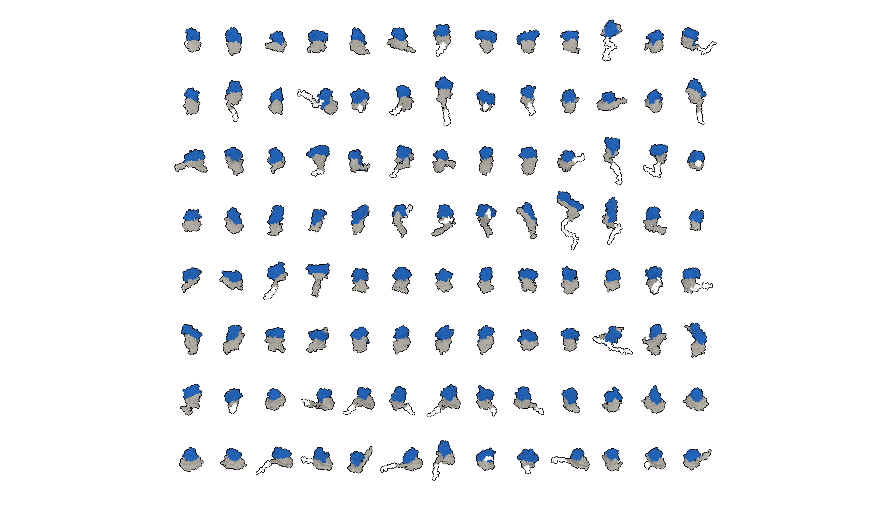

<div align="center">

<a href="https://bindome.epfl.ch/static/index.html"></a>

[Website](https://bindome.epfl.ch/static/index.html) •
[HuggingFace](https://huggingface.co/datasets/wjulius/HumanBindome) • [MCP](https://bindome.epfl.ch/mcp) • [Beacons-API](https://bindome.epfl.ch/docs) • Preprint (tba)


**Towards a protein binder candidate for every human protein**

</div>

### Resource

Bindome is a proteome-scale atlas of high-confidence in silico protein binder candidates. It contains >300,000 binder candidates covering >8,200 human proteins (>40% of the proteome). Every candidate carries a defined sequence, a predicted binder-target structure model, and in silico confidence metrics. We anticipate that the Bindome will be valuable for the scientific community by providing affinity and perturbation reagents with broad applications in dissecting biological mechanisms as well as in drug and target discovery. Please find here the code base to generate Bindome. 

### Instructions

The pipeline has three stages, run in order: [TargetPreprocessing](TargetPreprocessing) prepares target structures and domains, [SweepScripts](SweepScripts) sets up and submits the binder design sweep, and [BindCraft](BindCraft) generates the actual binders. All three run in a single conda environment, set up once as described below.

## Installation

Step 1: Clone the repository

```bash
git clone https://github.com/wejulius/Bindome.git
```

Step 2: Install the conda environment and change permissions

```bash
bash Bindome/BindCraft/install_bindcraft.sh --cuda '12.4' --pkg_manager 'conda'
chmod +x Bindome/BindCraft/functions/DAlphaBall.gcc
chmod +x Bindome/BindCraft/functions/dssp
```

This creates a single `BindCraft` conda environment (ColabDesign, PyRosetta, JAX, biopython, requests, python-igraph, etc.) used to run our accelerated BindCraft framework, `TargetPreprocessing`, and `SweepScripts`. [env/leonardo-production-environment.yaml](env/leonardo-production-environment.yaml) is a pinned package list (`conda list`) of this environment as deployed in production on the Leonardo cluster — use it to diff against your own environment if you run into version-related issues.

## Running

### Target preprocessing

Fetches target structures/PAE from AlphaFold DB, segments them into domains, and builds the sweep index used by the design sweep. See [TargetPreprocessing/README.md](TargetPreprocessing/README.md) for the step-by-step scripts.

### Design sweep

Sets up the sweep file structure and submits/tracks the slurm array jobs that run our accelerated BindCraft over the sweep index. See [SweepScripts/README.md](SweepScripts/README.md) for details.

## Citations

TBA

## Acknowledgements

This repository directly builds on:
- [BindCraft](https://github.com/martinpacesa/BindCraft) (release v1.5.2)
- [pae_to_domains](https://github.com/tristanic/pae_to_domains)
- [FreeBindCraft](https://github.com/cytokineking/FreeBindCraft/tree/master)

Moreover, Bindome would not be possible without these softwares:
- [ColabDesign](https://github.com/sokrypton/ColabDesign)
- [AlphaFold](https://github.com/google-deepmind/alphafold)
- [ProteinMPNN](https://github.com/dauparas/ProteinMPNN)
- [PyRosetta](https://www.pyrosetta.org/)


